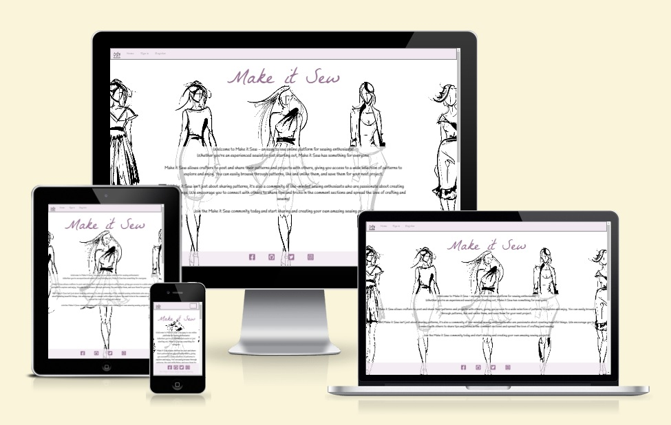
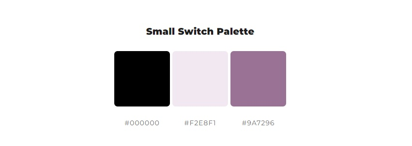

# Make it Sew

## Milestone project 4

Make it Sew is a fullstack web application that gives users a platform to view and share sewing patterns. Users can post and edit patterns, leave comments and like patterns to save for later. 
The intended target audience is people of all ages interested in sewing and sharing their sewing patterns. 

The application impliments user authorisation and full CRUD functionality, allowing users to create, read, update and delete patterns stored in a relational database management system. The site also uses Djangos built in back-end admin dashboard, letting the site administrator approve, publish and delete posts and comments. 

Make it Sew is a fictional website created as a milestone project as a student at Code Institute. 

## Live website
Link to live website [Make it Sew](https://make-it-sew.herokuapp.com/)

## Table of contents

- [Make it Sew](#make-it-sew)
- [Live website](#live-website)
- [Project purpose](#project-purpose)
- [User stories](#user-stories)

## Project

### Objective

The objective of this project and website was to create a fourth portfolio submission for Code Institutes fullstack developer program. Among following the projects assessment criteria, the website needed to be built using HTML, CSS, Python, Javascript and the Django framework. The website needed to have full CRUD functionality, using at least one original model and user authorization. 

The project needed to be planned and executed using agile methods, for which I've used Github issues and project board to plan out. 

I decided to build a website pandering to my own interests and inspiration, why I choose to create a site about sewing and sharing sewing patterns. With the tight time schedule for this project I have tried keeping the scope of it consice. In the future more interesting features could be added to expand the site further. 

### Site user goal

Users of Make it Sew could have several goals, such as wanting to take part of and share sewing patterns, interact with other users with shared interests and a place to store their own sewing pattern, as well as share their own knowledge and tips with others. 

### Site owner goal

As a site owner the goal is to provide a stable and enjoyable user experience, that encourages user interaction. The website should be accessible, appealing and contain content that is well structured, intuitive and of high standard. Site administrator should make sure the content is monitored to meet community standard. 

## User stories

### Agile 

### User stories

## Typography and color scheme

### Typography
 For the fonts on the website I've used La Belle Aurore and Handlee, imported from [Google fonts](https://fonts.google.com/).

Icons are imported from [Font awesome](https://fontawesome.com/) for the like button heart and to highlight the difficulty and suggested fabrics sections. 

### Color scheme

The color scheme consists of mainly black and white, with pink and purple accents. The idea is to let the stylized image on the home page set the tone and have the color scheme accentuate that. Color palette image is made using [ColorSpace](https://mycolor.space/)

### Imagery

Images for the index page jumbotron and sewing patterns are sourced from [Shutterstock](https://www.shutterstock.com/). 

## Features

### Existing features

### Future features 

Download PDF
Like button on cards
Search bar
User edit/delete comments

## Wireframes

## Database schema

## Technology

## Testing

## Deployment

## Credits

