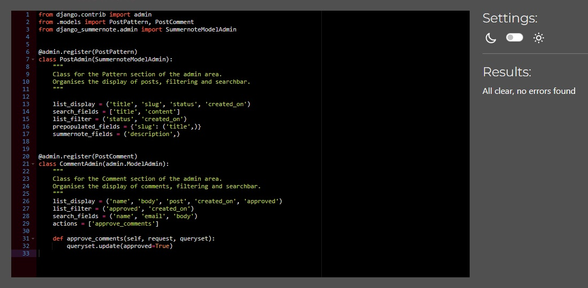
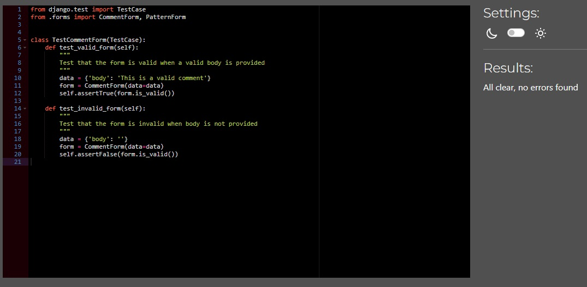

# Make it Sew

## Milestone project 4

Make it Sew is a fullstack web application that gives users a platform to view and share sewing patterns. Users can post and edit patterns, leave comments and like patterns to save for later. 
The intended target audience is people of all ages interested in sewing and sharing their sewing patterns. 

The application impliments user authorisation and full CRUD functionality, allowing users to create, read, update and delete patterns stored in a relational database management system. The site also uses Djangos built in back-end admin dashboard, letting the site administrator approve, publish and delete posts and comments. 

Make it Sew is a fictional website created as a milestone project as a student at Code Institute. 

## Live website
Link to live website [Make it Sew](https://make-it-sew.herokuapp.com/)

## Table of contents

- [Make it Sew](#make-it-sew)
- [Live website](#live-website)
- [Project](#project)
    - [Objective](#objective)
    - [Site user goal](#site-user-goal)
    - [Site owner goal](#site-owner-goal)
- [Project management](#project-management)
    - [Github project board, user stories, issues and milestones](#github-project-board-user-stories-issues-and-milestones)
    - [Wireframes](#wireframes)
    - [Database schema](#database-schema)
- [Typography and color scheme](#typography-and-color-scheme)
    - [Typography](#typography)
    - [Color scheme](#color-scheme)
    - [Imagery](#imagery)
- [Features](#features)
    - [Existing features](#existing-features)
    - [Future features](#future-features)
- [Technology](#technology)
    - [Languages](#languages)
    - [Frameworks](#frameworks)
    - [Other software and libraries](#other-software-and-libraries)
- [Testing](#testing)
    - [Automated tests](#automated-tests)
    - [Manual testing](#manual-testing)
        - [Browser test](#browser-test)
        - [Lighthouse](#lighthouse)
        - [PEP8 Python](#pep8-python)
- [Deployment](#deployment)
- [Credits](#credits)

# Project

## Objective

The objective of this project and website was to create a fourth portfolio submission for Code Institutes fullstack developer program. Among following the projects assessment criteria, the website needed to be built using HTML, CSS, Python, Javascript and the Django framework. The website needed to have full CRUD functionality, using at least one original model and user authorization. 

The project needed to be planned and executed using agile methods, for which I've used Github issues and project board to plan out. 

I decided to build a website pandering to my own interests and inspiration, why I choose to create a site about sewing and sharing sewing patterns. With the tight time schedule for this project I have tried keeping the scope of it consice. In the future more interesting features could be added to expand the site further. 

## Site user goal

Users of Make it Sew could have several goals, such as wanting to take part of and share sewing patterns, interact with other users with shared interests and a place to store their own sewing pattern, as well as share their own knowledge and tips with others. 

## Site owner goal

As a site owner the goal is to provide a stable and enjoyable user experience, that encourages user interaction. The website should be accessible, appealing and contain content that is well structured, intuitive and of high standard. Site administrator should make sure the content is monitored to meet community standard. 

# Project management

## Github project board, user stories, issues and milestones

The Make it Sew website was developed using an agile methodology to ensure a streamlined planning and design process. The Make it Sew GitHub Project Board and issues played a significant role in this process, allowing for the creation of user stories and their organization in the to-do, in progress and done sections. As work began, these tasks were moved from the to-do section, to the in-progress section and later to the done section when completed, providing an efficient way to track progress and manage tasks.

Make it Sew consists of 40 user stories, broken into acceptance criteria and tasks. Lables were used to mark issues with priorities, like "must have", "nice to have" or "future feature" to organize the work throughout the project. As the tasks in each user story was finished and ticked off, the issue was moved to the done section of the project board and closed. 

All user stories for Make it Sew can be found in the [Make it Sew github repository issues section](https://github.com/EmelieMarkkanen/make-it-sew/issues) or [Make it Sew project board](https://github.com/users/EmelieMarkkanen/projects/4).

User stories were sorted into iterations, Milestones, that were used to structure and allocate the work as the project went on.

## Wireframes

Wireframes created using [Lucidshart](https://www.lucidchart.com/) to plan the general flow and display of Make it Sew. Some differences may be found between the original wireframes and the finished site due to design choices made during the project process. 

[Index page](https://github.com/EmelieMarkkanen/make-it-sew/blob/main/assets/docs/Index%20page.pdf)

[All patterns, liked patterns, my patterns](https://github.com/EmelieMarkkanen/make-it-sew/blob/main/assets/docs/All%20patterns.pdf)

[Sign in, sign out, register](https://github.com/EmelieMarkkanen/make-it-sew/blob/main/assets/docs/signin.pdf)

[Post/edit pattern form](https://github.com/EmelieMarkkanen/make-it-sew/blob/main/assets/docs/Form.pdf)

## Database schema

Make it Sew consists of three models - PostPattern, PostComment and User. User is a Django built-in model. The database schema was used to plan the model and fields. 

[Database schema](https://github.com/EmelieMarkkanen/make-it-sew/blob/main/assets/docs/Database.pdf)

# Typography and color scheme

## Typography
 For the fonts on the website I've used La Belle Aurore and Handlee, imported from [Google fonts](https://fonts.google.com/).

Icons are imported from [Font awesome](https://fontawesome.com/) for the like button heart and to highlight the difficulty and suggested fabrics sections. 

## Color scheme

The color scheme consists of mainly black and white, with pink and purple accents. The idea is to let the stylized image on the home page set the tone and have the color scheme accentuate that. Color palette image is made using [ColorSpace](https://mycolor.space/)

## Imagery

Images for the index page jumbotron, navbar logo and sewing patterns are sourced from [Shutterstock](https://www.shutterstock.com/). 

# Features

## Existing features

## Home page

### Home page and introduction
The homepage is the first page of the site the user is met with when navigating to the Make it Sew url. It is designed to give the user a feel for and quick summary of the sites objective. 

### Navigation
The site feature a navbar that is present on all pages of the site. The navbar links change depending on wether the user is logged in or not, giving the user access to different features of the site. If the user is not logged in, the navbar show links to the sign in or sign up pages. If a user is logged in the navbar shows links to the all patterns, my patterns, liked patterns, post pattern and sign out page.
Viewing the site on a smaller screen make the navbar collapse for a mobile menu. 

### Footer
The site features a footer that is present on all pages of the site, with links to relevant social media sites. The footer is fully responsive to different screen sizes. 

### Featured patterns
The homepage features three cards with featured patterns, set by the site administrator, to give the user a preview of what the site offer. The cards display an image, a link to a detailed page about the pattern and the amount of likes the specific pattern have got. 

### Login to view all patterns button
If a user is not logged in, a button reffering the user to the login page is visible under the featured patterns cards. 

## Detailed pattern page

### Like button

- Comment section with validation
- Full details
- Notifications
- Delete pattern button
- Edit pattern button
- Login in to comment or edit button

Post pattern page
- Post pattern form with validation
- Notifications

Edit pattern page
- Prepopulated form with validation
- Notifications

My patterns page
- Users posted pattern list
- Pagination

All patterns page 
- All posted patterns list
- Pagination

Liked patterns page 
- Users liked patterns list
- Pagination

Authorization
- Login 
- Logout
- Register

404 page

### Future features 

Download PDF

Like button on cards

Search bar

User edit/delete comments

About page/contact page

## Technology

### Languages

- HTML5
- CSS3
- Python
- Git 

### Frameworks

- Django
- Bootstrap

### Other software and libraries

- Heroku
- Github
- ElephantSQL
- Google Chrome dev tools
- Lighthouse
- Am I Responsive
- Crispy forms
- Allauth
- Cloudinary
- Summernote
- Gunicorn
- CI Python linter
- W3 HTML and CSS validators

## Testing

### Automated tests

Due to time contstraints and the ElephantSQL database and model having compatibility issues the automated testing was not able to be carried out fully. 
With help from fellow students and alumni on Slack I finally found a solution by using a temporary Django sqlite3 database for testing, and focused on testing the CommentForm at the moment to include some automated testing in this project. 

In the future I would like to add additional automated testing for the models, views and forms. 

### Manual testing

The Make it Sew website have been continualy tested manually troughout development and followed up with testing through Lighthouse, W3C and PEP8. 

### Browser test 

Make it Sew have been tested in Chrome, Edge and Firefox with no errors found in functionality. 

### W3C HTML and CSS

Make it Sew was passed through W3C HTML Markup validation and showed a few errors of missing endtags and issues with button and a tag relations that were fixed.

Make it Sew was passed through W3C CSS validation with no errors found. 

### Lighthouse

Make it Sew have been tested using Chrome developer Lighthouse tester. During testing it was discovered that the website have some issues with performance, which seems to mostly be due to Bootstrap CSS not being utilized as effectively as it could. With more time I would have liked to optimze this using Devtools Coverage Tool and defer non-critical CSS. 

### PEP8 Python 

I used the [Code Institute Python linter](https://pep8ci.herokuapp.com/#) to test all Make it Sew python code. Some errors of too long lines and trailing whitespaces were found and corrected. 

#### Admin.py

#### Apps.py

#### Forms.py

#### Models.py

#### Views.py

#### Urls.py

#### Test_forms.py

## Deployment

## Credits

