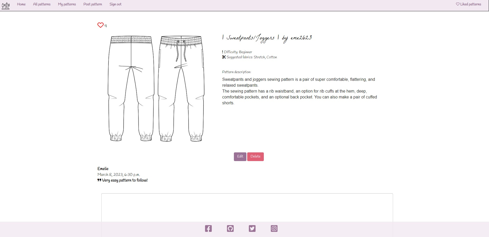
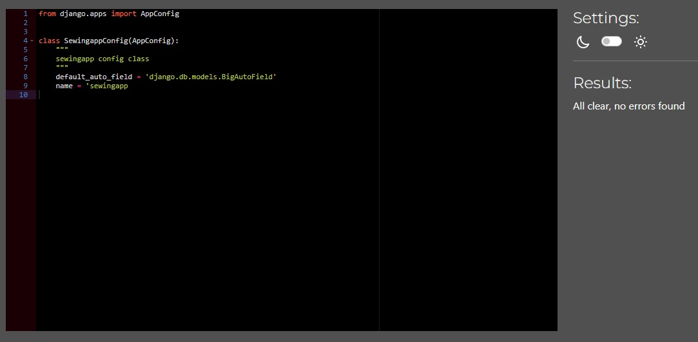
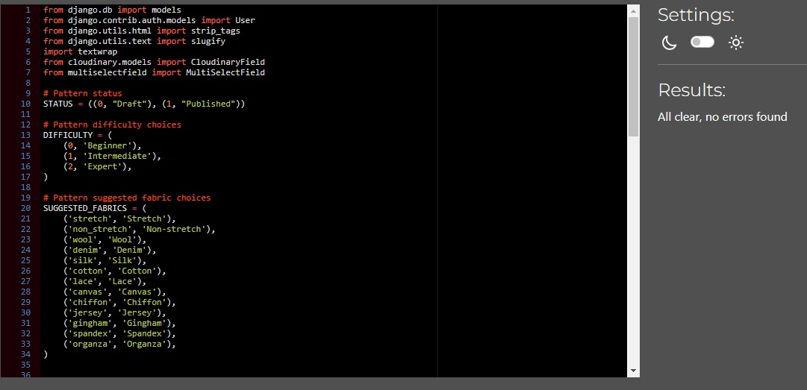

# Make it Sew

## Milestone project 4

Make it Sew is a fullstack web application that gives users a platform to view and share sewing patterns. Users can post and edit patterns, leave comments and like patterns to save for later. 
The intended target audience is people of all ages interested in sewing and sharing their sewing patterns. 

The application impliments user authorisation and full CRUD functionality, allowing users to create, read, update and delete patterns stored in a relational database management system. The site also uses Djangos built in back-end admin dashboard, letting the site administrator approve, publish and delete posts and comments. 

Make it Sew is a fictional website created as a milestone project as a student at Code Institute. 

## Live website
Link to live website [Make it Sew](https://make-it-sew.herokuapp.com/)

## Table of contents

- [Make it Sew](#make-it-sew)
- [Live website](#live-website)
- [Project](#project)
    - [Objective](#objective)
    - [Site user goal](#site-user-goal)
    - [Site owner goal](#site-owner-goal)
- [Project management](#project-management)
    - [Github project board, user stories, issues and milestones](#github-project-board-user-stories-issues-and-milestones)
    - [Wireframes](#wireframes)
    - [Database schema](#database-schema)
- [Typography and color scheme](#typography-and-color-scheme)
    - [Typography](#typography)
    - [Color scheme](#color-scheme)
    - [Imagery](#imagery)
- [Features](#features)
    - [Existing features](#existing-features)
    - [Future features](#future-features)
- [Technology](#technology)
    - [Languages](#languages)
    - [Frameworks](#frameworks)
    - [Other software and libraries](#other-software-and-libraries)
- [Testing](#testing)
    - [Automated tests](#automated-tests)
    - [Manual testing](#manual-testing)
        - [Browser test](#browser-test)
        - [Lighthouse](#lighthouse)
        - [PEP8 Python](#pep8-python)
- [Deployment](#deployment)
    - [Github & Gitpod](#github--gitpod)
    - [Create a Django project and app](#create-a-django-project-and-app)
    - [ElephantSQL](#elephantsql)
    - [Heroku](#heroku)
- [Credits](#credits)

# Project

## Objective

The objective of this project and website was to create a fourth portfolio submission for Code Institutes fullstack developer program. Among following the projects assessment criteria, the website needed to be built using HTML, CSS, Python, Javascript and the Django framework. The website needed to have full CRUD functionality, using at least one original model and user authorization. 

The project needed to be planned and executed using agile methods, for which I've used Github issues and project board to plan out. 

I decided to build a website pandering to my own interests and inspiration, why I choose to create a site about sewing and sharing sewing patterns. With the tight time schedule for this project I have tried keeping the scope of it consice. In the future more interesting features could be added to expand the site further. 

## Site user goal

Users of Make it Sew could have several goals, such as wanting to take part of and share sewing patterns, interact with other users with shared interests and a place to store their own sewing pattern, as well as share their own knowledge and tips with others. 

## Site owner goal

As a site owner the goal is to provide a stable and enjoyable user experience, that encourages user interaction. The website should be accessible, appealing and contain content that is well structured, intuitive and of high standard. Site administrator should make sure the content is monitored to meet community standard. 

# Project management

## Github project board, user stories, issues and milestones

The Make it Sew website was developed using an agile methodology to ensure a streamlined planning and design process. The Make it Sew GitHub Project Board and issues played a significant role in this process, allowing for the creation of user stories and their organization in the to-do, in progress and done sections. As work began, these tasks were moved from the to-do section, to the in-progress section and later to the done section when completed, providing an efficient way to track progress and manage tasks.

Make it Sew consists of 40 user stories, broken into acceptance criteria and tasks. Lables were used to mark issues with priorities, like "must have", "nice to have" or "future feature" to organize the work throughout the project. As the tasks in each user story was finished and ticked off, the issue was moved to the done section of the project board and closed. 

All user stories for Make it Sew can be found in the [Make it Sew github repository issues section](https://github.com/EmelieMarkkanen/make-it-sew/issues) or [Make it Sew project board](https://github.com/users/EmelieMarkkanen/projects/4).

User stories were sorted into iterations, Milestones, that were used to structure and allocate the work as the project went on.

## Wireframes

Wireframes created using [Lucidshart](https://www.lucidchart.com/) to plan the general flow and display of Make it Sew. Some differences may be found between the original wireframes and the finished site due to design choices made during the project process. 

[Index page](https://github.com/EmelieMarkkanen/make-it-sew/blob/main/assets/docs/Index%20page.pdf)

[All patterns, liked patterns, my patterns](https://github.com/EmelieMarkkanen/make-it-sew/blob/main/assets/docs/All%20patterns.pdf)

[Sign in, sign out, register](https://github.com/EmelieMarkkanen/make-it-sew/blob/main/assets/docs/signin.pdf)

[Post/edit pattern form](https://github.com/EmelieMarkkanen/make-it-sew/blob/main/assets/docs/Form.pdf)

## Database schema

Make it Sew consists of three models - PostPattern, PostComment and User. User is a Django built-in model. The database schema was used to plan the model and fields. 

[Database schema](https://github.com/EmelieMarkkanen/make-it-sew/blob/main/assets/docs/Database.pdf)

# Typography and color scheme

## Typography
 For the fonts on the website I've used La Belle Aurore and Handlee, imported from [Google fonts](https://fonts.google.com/).

Icons are imported from [Font awesome](https://fontawesome.com/) for the like button heart and to highlight the difficulty and suggested fabrics sections. 

## Color scheme

The color scheme consists of mainly black and white, with pink and purple accents. The idea is to let the stylized image on the home page set the tone and have the color scheme accentuate that. Color palette image is made using [ColorSpace](https://mycolor.space/)

## Imagery

Images for the index page jumbotron, navbar logo and sewing patterns are sourced from [Shutterstock](https://www.shutterstock.com/). 

# Features

## Existing features

## Home page

### Home page and introduction
The homepage is the first page of the site the user is met with when navigating to the Make it Sew url. It is designed to give the user a feel for and quick summary of the sites objective. 

### Navigation
The site feature a navbar that is present on all pages of the site. The navbar links change depending on wether the user is logged in or not, giving the user access to different features of the site. If the user is not logged in, the navbar show links to the sign in or sign up pages. If a user is logged in the navbar shows links to the all patterns, my patterns, liked patterns, post pattern and sign out page. The navbar also features a logo image of a sewing machine. 
Viewing the site on a smaller screen make the navbar collapse for a mobile menu. 

### Footer
The site features a footer that is present on all pages of the site, with links to relevant social media sites. The footer is fully responsive to different screen sizes. 

### Featured patterns
The homepage features three cards with featured patterns, set by the site administrator, to give the user a preview of what the site offer. The cards display an image, a link to a detailed page about the pattern and the amount of likes the specific pattern have got. 

### Login to view all patterns button
If a user is not logged in, a button reffering the user to the login page is visible under the featured patterns cards. 

## Detailed pattern page

### Full details
The page features a title, authors username, full description of the pattern, with a pattern difficulty and suggested fabrics section. For the author of the post an edit and delete button is available. For other users the page features a button, "View pattern". The idea is to add a future functionality where users can view and download a PDF of a sewing pattern. 

### Like button
The page features a heartshaped likebutton and numberdisplay of how many users have liked the post. A logged in user can click the button, which increase the amount of likes, and change the color of the button. A user who is not logged in will only see a heartshaped icon with a display of how many likes. Clicking the likebutton will also notify the user that the pattern have been saved to the Liked patterns page. Clicking again will notify the user that the pattern have been removed from the Liked patterns page. 

### Comment section form

The page features a comment section where logged in users can post comments on the specific pattern. When a  logged in user have posted a comment, they are notified that the comment will be visible after approval from a site administrator. 
Users who are not logged in can read the comments but the post comment button will refer the user to the login page.

The comment form can not be posted unless it is valid, which the user is notified of if they try to send an empty form. 

### Delete pattern 
A logged in user who is also the author of a pattern post will have a delete pattern button available. This button uses defensive programming, opening up a notification asking if the user really want to delete the post. Clicking delete will delete the pattern from the database, while clicking cancel will close the notification. 

### Edit pattern
A logged in user who is also the author of a pattern post will have an edit pattern button available. This will refer the user to an edit pattern form, prepopulated with the post details. 

### Notifications
The user is notified with an automatic message when clicking the like button, posting a comment or trying to post an invalid comment form. 

## Post pattern page

### Post pattern form 
The post pattern page features a form to enable users to submit a pattern to Make it Sew. This page is only available to logged in users. 
The form features a title, description, file and image field. The user can also choose a pattern difficulty option and a multiple options of suggested fabrics. When the user click the submit button they are notified that the pattern will be available after approval from site administrator. If a user try to post an invalid form, they are notified how to correct their post and it is not submitted. 

### Notifications
The user is notified with an automatic message when clicking the submit button or if they try posting an invalid form. 

## Edit pattern page

### Edit pattern form
The edit pattern page features a prepopulated form to enable users to edit a pattern posted to Make it Sew. This page is only available to logged in users who is the author of the specific pattern post.
This form features the same fields as the post pattern form. When the user click the submit button they are notified that the edited pattern will be available after approval from site administrator. If a user try to post an invalid form, they are notified how to correct their post and it is not submitted. 

### Notifications
The user is notified with an automatic message when clicking the submit button or if they try posting an invalid form. 

## My patterns page

### Users posted patterns list
The my patterns page features a list of all the patterns posted by the logged in user, that have been approved by a site administrator. The page is only available to logged in users. 
If a user have not posted any patterns they are shown a message and a button referring the user to the post pattern page. 
The page paginates by 6 items, showing a next/previous link if the user have posted more than 6 patterns. 

## All patterns page 

### All posted patterns list
The all patterns page features a list of all the patterns posted to Make it Sew, that have been approved by a site administrator. The page is only available to logged in users. 
The page paginates by 9 items, showing a next/previous link if there are more than 9 posts made on the website. 

## Liked patterns page 

### Users liked patterns list
The liked patterns page features a list of all the patterns liked by the logged in user. The page is only available to logged in users. 
If a user have not liked any patterns they are shown a message and a button referring the user to the all patterns page. 
The page paginates by 6 items, showing a next/previous link if the user have liked more than 6 patterns. 

## Authorization

### Allauth
Make it Sew uses the Allauth application to handle authentication, registration and account management. Allauth comes with templates and forms that have been styled to match the Make it Sew design. 

### Register
A user can navigate to the register page via the navbar Register link. The page features a form with a username, email (optional) and password field, with a second password check field. 
If the user tries to post an invalid form they are notified, and the form is not submitted.
Submitting a valid form redirects the user to the home page as a logged in user.

### Sign in 
A user can navigate to the login page via the navbar Sign in link. The page features a form for username and password, and a link to the register new user page if the user is not already registered with Make it Sew. 
Once logged in the user is redirected to the home page as a logged in user. 

### Sign out
A user can navigate to the logout page via the navbar Sign out link. The page promts the user with a message asking if the user want to log out. If the user clicks the sign out button they are redirected to the home page as a logged out user. 

## 404 page
If a user attempts to access a URL on a website that doesn't exist, the 404 page will be triggered. This error page is a safety net for instances where links are faulty, or URLs have expired. While this page is not frequently seen, it is essential to have it available for those who may encounter errors. The main goal of the 404 page is to alert the user that an error has occurred, and the page they attempted to reach cannot be found. To help users get back on track, the Make it Sew 404 page provides a button link to the homepage, allowing for a simple return to the starting point.

## Future features 

Serveral other features could be added to Make it Sew to create further value for users. These are some of the features I would like to add in the future. 

### Download PDF button
A way for users to download the pdf of a sewing pattern that have been uploaded. This has been added to the Make it Sew backlog milestone, because Cloudinary that is used for storage solution don't support PDF downloads for safety reasons. Comment on this can be read in the [user story issue](https://github.com/EmelieMarkkanen/make-it-sew/issues/40).

### Like button on cards
A user could be able to click a like button on the cards featuring a preview of the pattern post. At the moment only the amount of likes is displayed. 

### Search bar
A searchbar for searching for specific posts on Make it Sew. 

### User edit/delete comments
An delete and edit button for comments available to users. 

### About page 
A separate page for more information about Make it Sew.

### Contact form 
A contact form to contact site owner. 

### Most liked patterns
A page featuring the patterns with most likes by all users. 

# Technology

## Languages

- HTML5
- CSS3
- Python
- Git 

## Frameworks

- Django
- Bootstrap

## Other software and libraries

- Heroku
- Github
- ElephantSQL
- Google Chrome dev tools
- Lighthouse
- Am I Responsive
- Crispy forms
- Allauth
- Cloudinary
- Summernote
- Gunicorn
- CI Python linter
- W3 HTML and CSS validators

# Testing

# Automated tests

Due to time contstraints and the ElephantSQL database and model having compatibility issues the automated testing was not able to be carried out fully. 
With help from fellow students and alumni on Slack I finally found a solution by using a temporary Django sqlite3 database for testing, and focused on testing the CommentForm at the moment to include some automated testing in this project. 

In the future I would like to add additional automated testing for the models, views and forms. 

# Manual testing

The Make it Sew website have been continualy tested manually troughout development and followed up with testing through Lighthouse, W3C and PEP8. 

## Browser test 

Make it Sew have been tested in Chrome, Edge and Firefox with no errors found in functionality. 

## W3C HTML and CSS

Make it Sew was passed through W3C HTML Markup validation and showed a few errors of missing endtags and issues with button and a-tag relations that were fixed.

Make it Sew was passed through W3C CSS validation with no errors found. 

## Lighthouse

Make it Sew have been tested using Chrome developer Lighthouse tester. During testing it was discovered that the website have some issues with performance, which seems to mostly be due to Bootstrap CSS not being utilized as effectively as it could. With more time I would have liked to optimze this using Devtools Coverage Tool and defer non-critical CSS. 

## PEP8 Python 

I used the [Code Institute Python linter](https://pep8ci.herokuapp.com/#) to test all Make it Sew python code. Some errors of too long lines and trailing whitespaces were found and corrected. 

### Admin.py

### Apps.py

### Forms.py

### Models.py

### Views.py

### Urls.py

### Test_forms.py

## Bugs

### Fixed
- [When editing a pattern changes are rendered on the page without admin approval](https://github.com/EmelieMarkkanen/make-it-sew/issues/32)
- [Tests compatibility issues with database](https://github.com/EmelieMarkkanen/make-it-sew/issues/43)

### Not fixed
- [PDF is not displayed in a new tab, error message says PDF can't be read](https://github.com/EmelieMarkkanen/make-it-sew/issues/40)
- [Line up content in register form](https://github.com/EmelieMarkkanen/make-it-sew/issues/42)

# Deployment

The master branch of this repository has been used for the deployed version of this application.

## Github & Gitpod

I created a repository in Github, named it ´make-it-sew´, and used the template Code-Institute-Org/gitpod-full-template

- Once the repository is created, click the green button to the right (Gitpod) to open a new Gitpod workspace. 
- To open and work on the project it is best to open the workspace from Gitpod workspaces (rather than Github), this will open your previous workspace rather than creating a new one. You should pin the workspace. 
- Committing changes should be done often and should have clear messages. Use the following commands to make your commits:
    - `git add .`: adds all modified files to a staging area
    - `git commit -m "A message explaining your commit"`: commits all changes to a local repository.
    - `git push`: pushes all your committed changes to your Github repository.

## Create a Django project and app

- Install Django and supporting libraries. I've used Gunicorn, Cloudinary and psycopg2 to start. 
- In the terminal of the Gitpod workspace type django-admin startproject 'project_name' - project_name is desired project name
- In the terminal of the Gitpod workspace type python3 manage.py startapp 'app_name' - app_name is desired app name 
- Create a Requirements.txt file (type pip3 freeze --local > requirements.txt), a env.py file and Procfile on the top level of the project directory. 
- In settings.py add the installed apps names into the installed apps array variable and save the file.
- Move the SECRET KEY to the env.py file, and add the DATABASE URL and CLOUDINARY URL as well. 
- Migrate changes by using the command python3 manage.py migrate.

## ElephantSQL

- Log into ElephantSQL or create new account.
- Click to create new instance and set up the plan by giving it a name, I selected the tiny turtle plan. 
- Select a region (data center) closest to your location. 
- Click review, check that all the details are correct and then click create instance. 
- Return to the ElephantSQL dashboard and click on the database instance name for the project.
- Copy the ElephantSQL database URL that begin with 'postgres://' using the copy icon. 

## Heroku

I followed the steps in the Code Institute course material and [Django Blog cheatsheet](https://codeinstitute.s3.amazonaws.com/fst/Django%20Blog%20Cheat%20Sheet%20v1.pdf)

- Log into Heroku or create an account.
- Click ´New´ create new heroku app. Give the app an app name and select your region, I chose Europe. 
- Open the app settings tab and click ´Reveal config vars´
- Add a config var called ´DATABASE_URL´ and paste in the ElephantSQL database URL
- Add the config var ´SECRET KEY´ with the secret key from the Django app settings.py file. It is recommended to create a new secret key for safety purposes. 
- Add the config vars ´CLOUDINARY_URL´, ´DATABASE_URL´, ´PORT´ and ´DISABLE_COLLECTSTATIC´. 
- Under the project deploy tab, select GitHub for the deployment method. Search for the repository name and click connect. Scroll down to the manual deployment section and click deploy branch. Make sure you have the main branch selected. 

# Credits

